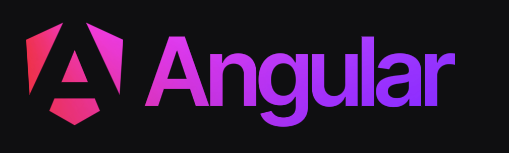

<p align="center">
  <a href="https://angular.io/" target="blank"></a>
</p>

<h1 align="center"> Manejo de Observables con Angular 17 </h1>

<h2 align="center"> Seccion 2 - Clase 5/6/7: Operators en rxjs </h1>

### Descripción:
Este repositorio contiene todo el avance del curso de OpenWebinars: Manejo de observables con Angular 17.

Esta rama contiene el código relacionado al avance de la clase 5/6/7 de la sección 2 en la que vimos el manejo de Operadores en un proyecto js con rxjs.

### Documentación:

* [Operators en RxJS](https://rxjs.dev/guide/operators)

### Requerimientos:
Para ejecutar este proyecto necesitas tener instalado: 
* [NodeJS 20.11](https://nodejs.org/en)

### Instalación:
* acceder a la carpeta fundamentos-de-rxjs y ejecutar:

```bash
npm install
```

### Ejecución:
* acceder a la carpeta fundamentos-de-rxjs y ejecutar:

```bash
node operators.js
```